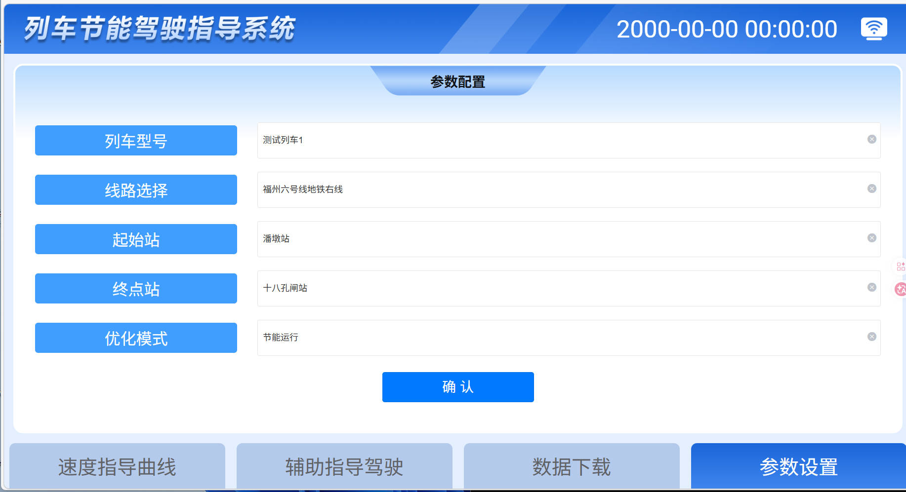
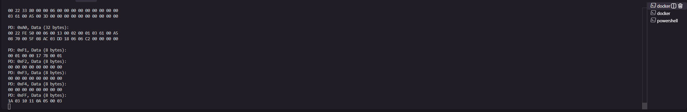
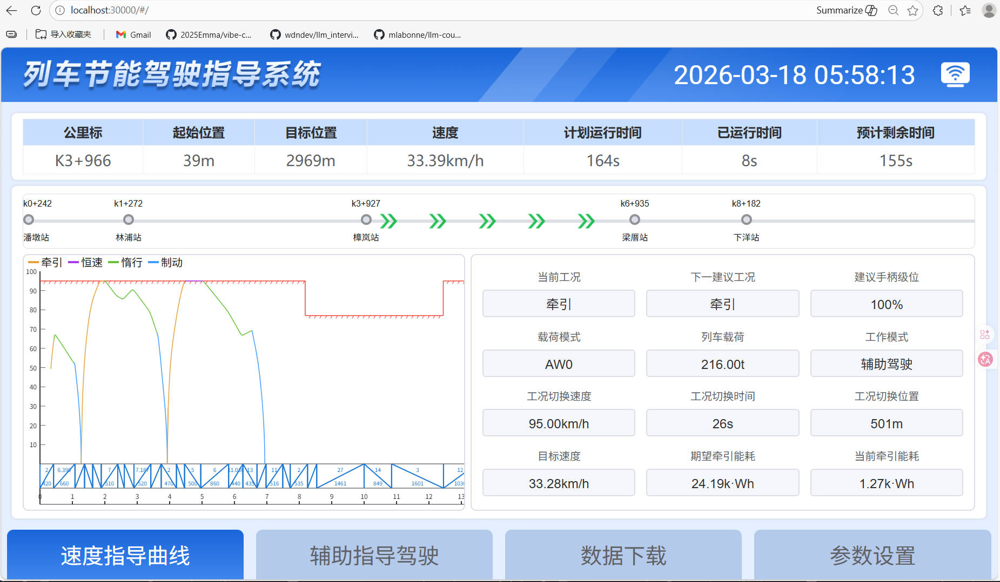

# 福州地铁前后端 - Docker 部署指南

## 项目概述

本项目包含 MetroDas 后端服务和 libmvbTest 测试工具的完整 Docker 开发环境。

由于 MVB通信模块依赖于硬件厂商提供的静态库，该库仅针对特定工控机平台（基于 ARM64 架构，Cortex-A55 + Cortex-A76 CPU）编译，无法直接在常规 x86_64 开发机上运行。为便于项目组成员在个人 PC（无论 Windows、macOS 或 Linux）上进行开发与调试，我们通过 Docker 容器技术封装了兼容的 ARM64 运行环境，并集成交叉编译工具链及所需依赖。

借助本 Docker 环境，开发者无需物理工控机即可本地构建、测试 MVB 相关功能，进行前后端的测试，显著提升开发效率与协作一致性。


### 系统架构

```
Windows 主机 (localhost:30000)
    ↓
Docker 容器 (ARM64)
    ├─ nginx (端口 24000) → Web 前端
    │   └─ /webApi/ → proxy_pass → MetroDas (端口 8000)
    ├─ MetroDas 后端服务 (端口 8000, 24001)
    └─ libmvbTest 测试工具
```

### 端口说明

| 端口 | 服务 | 说明 |
|------|------|------|
| 30000 | nginx | Web 前端界面（Windows 主机端口） |
| 30001 | MetroDas | 后端 API 服务（Windows 主机端口） |
| 30002 | MetroDas | UDP MVB 数据接收（Windows 主机端口） |

**注意**: 
- 容器内部端口：nginx(24000), API(8000), UDP(24001)
- Windows 主机端口：30000, 30001, 30002（避免 Windows 保留端口冲突）
- nginx 内部 proxy_pass 仍指向 127.0.0.1:8000，无需修改

---

## 前置要求

### 系统要求
- **Windows**: Windows 10/11 (64位), Docker Desktop for Windows, PowerShell 5.1 或更高版本
- **macOS**: macOS 10.15 或更高版本, Docker Desktop for Mac, 终端
- **Linux**: 支持 Docker 的 Linux 发行版, 终端
- **通用要求**: 至少 8GB RAM, 至少 20GB 可用磁盘空间

linux的docker安装参考博文：https://blog.csdn.net/lbbxmx111/article/details/156243366

### 软件安装

1. **安装 Docker Desktop**
   - 下载: https://www.docker.com/products/docker-desktop
   - 安装后启动 Docker Desktop
   - 确保 Docker 正在运行（系统托盘图标）

2. **验证 Docker 安装**
   ```powershell
   docker --version
   docker ps
   ```

3. ****docker engine**

```bash
{
  "builder": {
    "gc": {
      "defaultKeepStorage": "50GB",
      "enabled": true
    }
  },
  "experimental": true,
  "registry-mirrors": [
    "https://docker.m.daocloud.io",
    "https://hub-mirror.c.163.com",
    "https://mirror.baidubce.com",
    "https://dockerhub.icu",
    "https://docker.registry.cyou",
    "https://docker-cf.registry.cyou",
    "https://dockercf.jsdelivr.fyi",
    "https://docker.jsdelivr.fyi",
    "https://dockertest.jsdelivr.fyi",
    "https://mirror.aliyuncs.com",
    "https://dockerproxy.com",
    "https://mirror.baidubce.com",
    "https://docker.m.daocloud.io",
    "https://docker.nju.edu.cn",
    "https://docker.mirrors.sjtug.sjtu.edu.cn",
    "https://docker.mirrors.ustc.edu.cn",
    "https://mirror.iscas.ac.cn",
    "https://docker.rainbond.cc"
  ]
}
```

修改Resources的Disk Image Location为D盘的空白文件夹。

linux：
```bash
sudo vim /etc/docker/daemon.json
# 填写json内容后
sudo systemctl daemon-reload
sudo systemctl restart docker
sudo docker info | grep -A 10 "Registry Mirrors"
```
---

## 快速开始

### 步骤 1: 准备文件

**说明：**  由于`metrodas.tar.zr`是在实验室代码下开发的，是福州地铁项目的das代码。参与福州地铁项目开发的组内人员需要向我要这个文件。

**重要：** 在构建 Docker 镜像之前，必须将 `metrodas.tar.zr` 目录复制到目录下。


#### 验证目录结构

确保目录包含以下文件：

```
MAIN/
├── libmvbTest/             # ← 必须存在！
│   ├── CMakeLists.txt
│   ├── EGWM_SIM/
│   ├── include/
│   └── ...
├── Dockerfile              # Docker 镜像定义
├── build-image.ps1         # 镜像构建脚本 (Windows)
├── build-image.sh          # 镜像构建脚本 (macOS/Linux)
├── run-container.ps1       # 容器启动脚本 (Windows)
├── run-container.sh        # 容器启动脚本 (macOS/Linux)
├── compile-in-container.ps1 # 编译触发脚本 (Windows)
├── compile-in-container.sh  # 编译触发脚本 (macOS/Linux)
├── build-all.sh            # 编译脚本（容器内使用）
├── start-metrodas.sh       # 服务启动脚本（容器内使用）
├── nginx.conf              # nginx 配置文件
├── metrodas.tar.gz         # MetroDas 编译后的程序包
└── web/                    # Web 前端文件
    ├── index.html
    ├── assets/
    └── static/
```

注意在工控机下`libmvbTest\EGWM_SIM\csv_reader.cpp`当中的`loadPlannedTimesFromJson`
```cpp
QString configPath = "railway_config.json";
//修改为
QString configPath = "./bin/railway_config.json";
```

### 步骤 2: 构建 Docker 镜像

**Windows 用户**：在 `MAIN` 目录中打开 PowerShell，运行：

```powershell
.\build-image.ps1
```

**macOS/Linux 用户**：在 `MAIN` 目录中打开终端，运行：

```bash
./build-image.sh
```

**构建过程说明：**
1. 设置 QEMU ARM64 支持
2. 构建 Docker 镜像
3. 验证镜像

**预期输出：**
```
==================================
MetroDas Docker 镜像构建
==================================

检查必要文件...
  ✓ Dockerfile
  ✓ metrodas.tar.gz
  ✓ nginx.conf
  ✓ web

步骤 1/3: 设置 QEMU ARM64 支持...
  ✓ QEMU 设置完成

步骤 2/3: 构建 Docker 镜像...
  镜像名称: metrodas-env:latest
  平台: linux/arm64
  这可能需要几分钟时间...
  ...
  ✓ 镜像构建完成

步骤 3/3: 验证镜像...
  ✓ 镜像验证成功
  镜像大小: 2.6GB

==================================
✓ 构建完成！
==================================
```


:label:`docker镜像列表`

### 步骤 3: 启动容器

**Windows 用户**：在 `MAIN` 目录中打开 PowerShell，运行：

```powershell
.\run-container.ps1
```

**macOS/Linux 用户**：在 `MAIN` 目录中打开终端，运行：

```bash
./run-container.sh
```
若失败，执行
 netsh interface ipv4 show excludedportrange protocol=tcp

查看
Protocol tcp Port Exclusion Ranges

Start Port    End Port
----------    --------
     23983       24082      
     24083       24182
     24240       24339
     24373       24472
     27925       28024
     28385       28385
     28390       28390
     45941       46040
     50000       50059     *
windows上设置，避开这些端口
**容器启动后会自动：**
1. 映射端口 24000, 8000, 24001
2. 挂载 libmvbTest 目录（如果存在）
3. 启动 nginx
4. 进入容器 bash 终端

**预期输出：**
```
==================================
MetroDas 开发环境
==================================

端口映射:
  - 30000: Web 前端
  - 30001: 后端 API
  - 30002: UDP MVB 数据

访问地址: http://localhost:30000

启动服务...
✓ nginx 已启动

容器已就绪，使用以下命令启动 MetroDas:
  cd /workspace/metrodas/bin
  ./MetroDas

root@xxxxxxxxx:/workspace#
```

### 步骤 4: 编译和启动后端服务

**Windows 用户**：在 `MAIN` 目录中打开 PowerShell，运行：

```powershell
.\compile-in-container.ps1
```

**macOS/Linux 用户**：在 `MAIN` 目录中打开终端，运行：

```bash
./compile-in-container.sh
```

或者在容器内直接运行：

```bash
# 编译项目
./build-all.sh

# 启动服务
./start-metrodas.sh
```

### 步骤 5: 访问 Web 界面

1. 在 Windows 浏览器中打开: **http://localhost:30000**

2. 点击WIFI图标，页面上配置ip端口号为30001

3. 进行参数配置（但先不要点击"确定"按钮）


:label:`docker镜像列表`

### 步骤 6: 运行 libmvbTest 测试

**终端 1**：

```bash
docker exec -it metrodas-dev bash
cd libmvbTest/bin
chmod +x setup-virtual-serial.sh
./setup-virtual-serial.sh
./mvbtest
```

**终端 2**：

```bash
docker exec -it metrodas-dev bash
cd libmvbTest/bin
hexdump -C /tmp/vserial2
```



参数配置页面点击"确定"按钮，测试功能。




